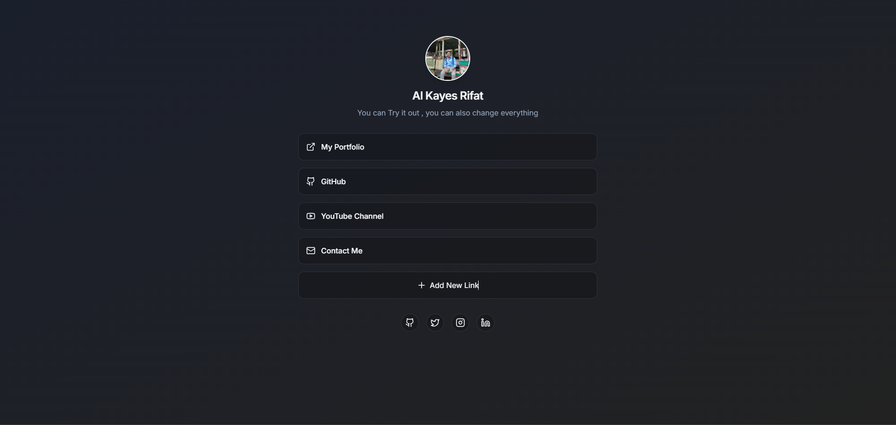

# Link.me 🔗

A sleek and customizable link-sharing app.

🚀 **Live Demo**: [Link.me](https://link-me-tau.vercel.app/)  
📂 **GitHub Repo**: [Link.me on GitHub](https://github.com/alkayesrifat/Link.me)  

## 📸 Preview  


## ✨ Features  
✅ Minimal and responsive UI  
✅ Add, edit, and remove links easily  
✅ Dark mode  
✅ Social media icons for quick navigation  


## 🚀 Getting Started  
### 1️⃣ Clone the repository  
```bash
git clone https://github.com/alkayesrifat/Link.me.git
cd Link.me
